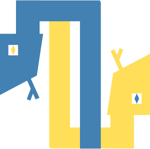
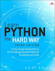
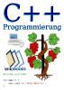
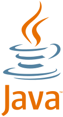

# Learning a Programming Language

We can help you learn the following languages:

- [Python](#python)
- [C++](#cpp)
- [Java for Android](#java)
- [Node.js](#nodejs)
- [Javascript and HTML](#jshtml)
- [C](#c)
- [PHP](#php)
- [C#](#csharp)
- [SQL](#sql)
- [Processing and p5js](#processing)
- [Lua and Löve](#love)
- [Programming for Kids](#kids)

Other Events around Zurich

- [Zürich C++ Meetup](https://www.meetup.com/Zurich-C-Meetup/)
- [IoT Zurich](https://www.meetup.com/IoT-Zurich/)
- [Zurich Python User Group](https://www.meetup.com/pyzurich/)
- [Hackergarten Zürich](https://www.meetup.com/Hackergarten-Zurich/)

If you have more question, you can get in touch with us in our [Chat channel](http://gitter.im/OpenTechSchool/ZH-Colearning).

If you want to suggest tutorials or books, please add a ticket to our [Github repository](https://github.com/opentechschool-zurich/opentechschool-zurich.github.io/issues).

## Python

If you want to learn programming, python is a good language to start with.

There are several online resources we are currently recommending:

{: .books}
- {: .book-cover .circle}  
  [Solo Learn](https://www.sololearn.com/course/python/)  
  You will not get very far, but you will be hold by hand...
- {: .book-cover}  
  [Programming Basics Python](https://www.et.ethz.ch/)  
  Online tutorial by the ETHZ
- {: .book-cover}  
  [Programmiergrundlagen Python](https://www.et.ethz.ch/): Online Kurs der ETH (mit Focus auf Datenanalysis)
- {: .book-cover}  
- [Learn Python the Hard Way](https://learnpythonthehardway.org/)
- {: .book-cover}  
  [Think Python 2e](https://greenteapress.com/wp/think-python-2e/)  
  Introduction to Python programming for beginners.

### Python and PyGame

You can directly dive into [PyGame](https://www.pygame.org/news), or first learn the educational frameworks [pygame zero](https://pygame-zero.readthedocs.io/en/stable/) or [pygame play](https://github.com/replit/play)

- [pygame zero cards]() vom coderdojo zürich ([auch auf deutsch]())

### Python and Flask

### Python, Jupyter and data science

### Python and PySide / PyQt

### Python and Shoebot

### Python and Scribus

{: #cpp}
## C++ 

{: .books}
- {: .book-cover}  
  [c++-programmierung](https://de.wikibooks.org/wiki/c%2b%2b-programmierung)
- {: .book-cover .circle}  
  [sololearn: c++](https://www.sololearn.com/course/cplusplus/): you will not get very far, but you will be hold by hand...

### C++ and Qt

### C++ and cmake

{: #java}
## Java for Android

{: .books}
- {: .book-cover}  
  [programmiergrundlagen java 1 und 2](https://www.et.ethz.ch/) von der eth
- {: .book-cover .circle}  
  [sololearn: java](https://www.sololearn.com/course/java/): you will not get very far, but you will be hold by hand...
- [Android - To-Do Liste #01 - Die ersten Schritte](https://www.youtube.com/watch?v=zEs-z8lLO-c)

{: #nodejs}
## Node.js

{: .books}
- {: .book-cover}  
  [Node School](https://nodeschool.io/): open source workshops that teach web software skills.

{: #jshtml}
## Javascript and HTML

### Javascript and JQuery

## C

## PHP

### Php and vue.js

### Php and Wordpress

### Php and Grav

{: #csharp}
## C#

## SQL

{: .books}
- {: .book-cover}  
  [Datenverwaltung mit SQLite]()

{: #processing}
## Processing and p5js

- [Einblick in die generative Gestaltung mit «Processing»](http://processing.internauta.ch/)

{: #love}
## Lua and Löve

{: #kids}
## Programming for Kids

We don't teach to kids, but there are other good (not for profit) events for them:

- [Scratch and Python @ CoderDojo Zürich](http://coderdojozh.ch/)
- [CoderDojo Luzern](https://coderdojoluzern.ch/)
- [Jugend Hackt](https://jugendhackt.org/events/ch/): Yearly Hacking weekend in Schaffausen.

## Other languages

Here is a list of common languages that we cannot support yet:

- ruby,
- scala,
- rust (but somebody suggested it... the proposal is still open)
- swift (and ios)
- r
- perl
- flutter / dart
- go
- kotlin
- lisp
- tcl/tk

If you have any idea, how we could add them to our list, get in touch with us!
